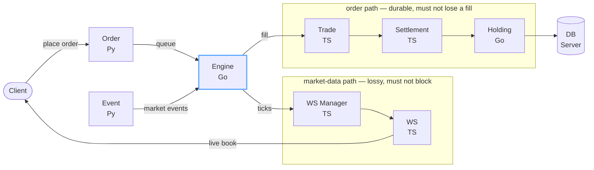

  <picture>
    <source media="(prefers-color-scheme: dark)" srcset="https://raw.githubusercontent.com/vanshpatelx/vanshpatelx/main/assets/header-dark.svg">
    
  </picture>

  
  
  
  

I run three companies and still write the code. Backend services and the infrastructure under them — order matching in Go, event pipelines, Kubernetes, and lately native macOS in Swift. Most of what is on this profile is me taking a system apart to find out what it costs to keep it running.

---

## Ventures

### [Oceanlab](https://oceanlab.in) &nbsp;·&nbsp; enterprise software engineering, human + AI

We design, build and operate enterprise-grade software for organisations that cannot afford to get it wrong — the velocity of AI prototyping with the rigour of senior human engineers, and compliance-ready from day one: SOC 2, HIPAA, ISO 27001, GDPR, PCI DSS.

### [Xocket](https://xocket.sh) &nbsp;·&nbsp; the execution layer for modern teams

AI-native developers who operate *inside* a team rather than alongside it — people who understand the product, talk to non-technical stakeholders in their own language, and ship materially faster than a traditional contract team. Building, not polishing.

### [Watermelon](https://watermelon.sh) &nbsp;·&nbsp; design infrastructure for startups

Startups move fast until design becomes the bottleneck: fragmented tools, inconsistent UI, velocity dying at the worst possible moment. Watermelon replaces the stitched-together stack with one ecosystem — Studio, UI, Native, Showcase and AI.

---

## Products

### [Black Hole](https://github.com/vanshpatelx/blackhole) &nbsp;·&nbsp; `SwiftUI` &nbsp;·&nbsp; [getblackhole.app](https://getblackhole.app)

Your whole day, one hover away. Tasks, a focus timer, a daily notepad and today's calendar live inside the MacBook notch. Press <kbd>⌥</kbd><kbd>Space</kbd> anywhere and type *"call mika tomorrow at 3pm"* — the date and time get lifted out of the sentence and it becomes a task with a reminder. During a focus session the notch turns into a live island with a progress ring and countdown. Reads iCloud, Google, Outlook and subscribed calendars; unfinished tasks roll over on their own. Free, open source, and no data leaves the machine.

### [Otter](https://github.com/vanshpatelx/Otter) &nbsp;·&nbsp; `TypeScript`

A local-first control center for AI coding agents spread across several machines. Rather than remote-controlling a computer, you reconnect to a persistent workspace that still holds its agents, dev servers, browser sessions and project context. A Worker runs on each machine; the desktop app is the console. Transport is direct and encrypted — Tailscale, WireGuard, LAN or an SSH tunnel — with an optional stateless relay. No source, prompts or conversations are uploaded anywhere.

---

## How the flagship works

[**Opinex**](https://github.com/vanshpatelx/Opinex) is a real-time opinion trading platform: ten services across three languages, on Kubernetes. The interesting part isn't the service count — it's that the order path and the market-data path are deliberately separate, so a slow fan-out to thousands of WebSocket clients can never back-pressure the matching engine.

Go for the hot path (matching, holdings), Python where the logic changes often (orders, market events), TypeScript at the edges. Docker Compose locally, unit → integration → E2E in CI, Kubernetes in cloud.

---

## Selected work

| Project | What it is | Stack |
| :--- | :--- | :--- |
| **[TradeEngine 2.0](https://github.com/vanshpatelx/TradeEngine2.0)** | Order matching engine rebuilt for throughput — the second attempt, after the first taught me where the time actually went | `Go` |
| **[benchmark](https://github.com/vanshpatelx/benchmark)** | Go vs Node under identical API load. Measured, rather than argued about | `Go` `Node` |
| **[multi-lang-turborepo](https://github.com/vanshpatelx/multi-lang-turborepo)** | One Turborepo driving Go, Rust, Python and TypeScript together — shared tasks, one `turbo dev` | `Turborepo` |
| **[AWS-K8s](https://github.com/vanshpatelx/AWS-K8s)** | Cluster bring-up on AWS from scratch, scripted | `Shell` `AWS` |
| **[CICD](https://github.com/vanshpatelx/CICD)** | Fully automated CI/CD environment, infrastructure as code | `Terraform` |
| **[Automated Blog System](https://github.com/vanshpatelx/AutomatedBlogCreationSystemWithApproval)** | Multi-agent writing pipeline: agents draft, Notion stores, a Telegram bot holds the approval gate before anything publishes | `Python` `AutoGen` `Gemini` |
| **[Learning Assistant](https://github.com/vanshpatelx/learningAssistant)** | Upload a book, get a tutor for it — retrieval over your own material | `LangChain` `FAISS` |
| **[xocket-website](https://github.com/vanshpatelx/xocket-website)** | Marketing site for Xocket — React 19, Vite, Tailwind v4, shadcn/ui | `React` `Vite` |
| **[MetaOffice](https://github.com/vanshpatelx/metaoffice)** | 2D metaverse office — own desks, meeting rooms, custom avatars | `TypeScript` |

---

## Toolkit

**Languages**&nbsp;&nbsp;

**Services & UI**&nbsp;&nbsp;

**Infrastructure**&nbsp;&nbsp;

**Data & AI**&nbsp;&nbsp;

---

<b>The numbers</b>

 

  

  <picture>
    <source media="(prefers-color-scheme: dark)" srcset="https://github-profile-summary-cards.vercel.app/api/cards/profile-details?username=vanshpatelx&theme=github_dark">
    
  </picture>

  <picture>
    <source media="(prefers-color-scheme: dark)" srcset="https://github-profile-summary-cards.vercel.app/api/cards/repos-per-language?username=vanshpatelx&theme=github_dark">
    
  </picture>
  <picture>
    <source media="(prefers-color-scheme: dark)" srcset="https://github-profile-summary-cards.vercel.app/api/cards/most-commit-language?username=vanshpatelx&theme=github_dark">
    
  </picture>

  <picture>
    <source media="(prefers-color-scheme: dark)" srcset="https://streak-stats.demolab.com?user=vanshpatelx&hide_border=true&background=00000000&ring=58A6FF&fire=F85149&currStreakLabel=58A6FF&stroke=30363D&dates=8B949E&sideLabels=C9D1D9&currStreakNum=C9D1D9&sideNums=C9D1D9">
    
  </picture>

Language breakdown reflects what my public code happens to be written in — not what I'm good at.

<!--
  The classic github-readme-stats cards are intentionally not used here: the public
  instance at github-readme-stats.vercel.app currently returns 503 DEPLOYMENT_PAUSED
  for every user, so those cards render as broken images. To bring them back, deploy
  your own instance (https://github.com/anuraghazra/github-readme-stats#deploy-on-your-own-vercel-instance)
  and point these URLs at it.
-->

<b>The back catalogue</b> — 117 repos, and what they're for

 

Most of this profile is deliberate practice, kept public on purpose. Roughly:

- **Distributed systems** — [trading-system](https://github.com/vanshpatelx/trading-system), [exchange](https://github.com/vanshpatelx/exchange), [Microservices-Event-driven](https://github.com/vanshpatelx/Microservices-Event-driven), [Kafka](https://github.com/vanshpatelx/Kafka), [rabbitMQ](https://github.com/vanshpatelx/rabbitMQ), [websockets](https://github.com/vanshpatelx/websockets)
- **Infra & DevOps** — [devenv](https://github.com/vanshpatelx/devenv), [devOpsInfra](https://github.com/vanshpatelx/devOpsInfra), [DevSecOps](https://github.com/vanshpatelx/DevSecOps), [civoK8s](https://github.com/vanshpatelx/civoK8s), [etoepipeline](https://github.com/vanshpatelx/etoepipeline)
- **AI & ML** — [virtual-ai](https://github.com/vanshpatelx/virtual-ai), [MeetingAI](https://github.com/vanshpatelx/MeetingAI), [Movie-recommendation-system-ML](https://github.com/vanshpatelx/Movie-recommendation-system-ML), [SP-500-Market-Prediction](https://github.com/vanshpatelx/SP-500-Market-Prediction), [FaceMask-Detection-using-CNN](https://github.com/vanshpatelx/FaceMask-Detection-using-CNN)
- **SDKs & libraries** — [hashnodeSDK](https://github.com/vanshpatelx/hashnodeSDK), [E-commerce-SDK](https://github.com/vanshpatelx/E-commerce-SDK), [ReactLib](https://github.com/vanshpatelx/ReactLib)
- **Fundamentals** — [Data-Structures](https://github.com/vanshpatelx/Data-Structures), [Algos](https://github.com/vanshpatelx/Algos), [Question-Pattens](https://github.com/vanshpatelx/Question-Pattens), [DSA-Roadmap](https://github.com/vanshpatelx/DSA-Roadmap)

---

  <a href="https://oceanlab.in"><b>Oceanlab</b></a> &nbsp;·&nbsp; <a href="https://xocket.sh"><b>Xocket</b></a> &nbsp;·&nbsp; <a href="https://watermelon.sh"><b>Watermelon</b></a>  
  Building something hard, or want to build it together? 
  <a href="mailto:remotevansh@gmail.com"><b>remotevansh@gmail.com</b></a>

